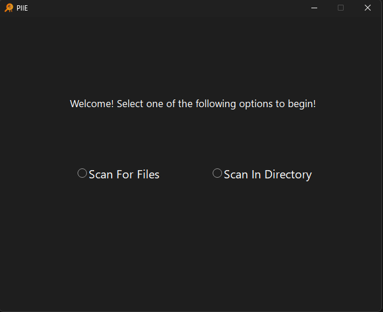
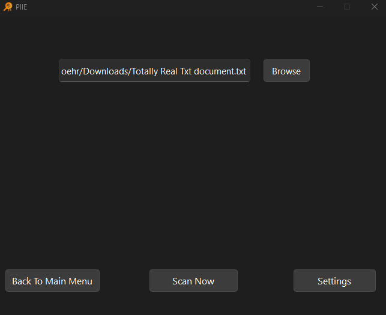
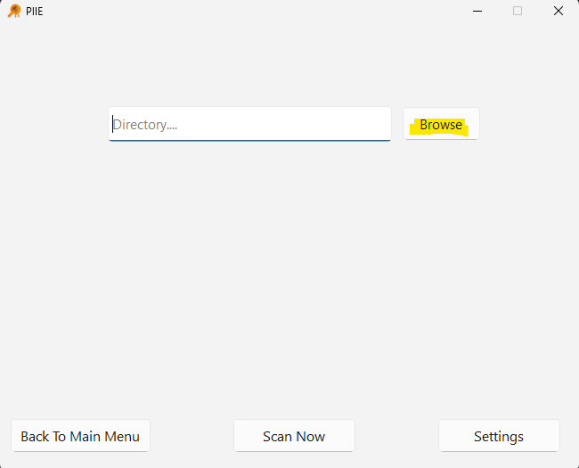

# About PIIE
>PIIE is a personally identifiable information (PII) detection tool that combines machine learning with a graphical interface. A fine-tuned named entity recognition (NER) model built with Hugging Face Transformers and spaCy identifies sensitive data such as names, addresses, and phone numbers across text, Word, and PDF files. The Python-based backend manages file scanning and JSON logging, while a PyQt interface enables user interaction. Packaged as a standalone Windows executable using BeeWare Briefcase and deployed through GitHub, the tool was tested for accuracy, reliability, and ease of use, providing an efficient local solution for data privacy management with the ability to scale into enterprise environments through centralized log forwarding. 
# Instructions to get started
* To get started with PIIE, please visit [here](http://127.0.0.1:8000/PIIE/ "Title")  and click our Icon to download the software
* Download the MSI, then run.(Please be aware microsoft doesn't recognise us and that the computer will warn you about downloading this application before allowing it. The install is safe, however it is not professionally bugtested)
* When done loading, you will see the options scan for file or scan from directory

## Scan from File
*Scan from file should be selected when you want PIIE to scan a single file from a folder*

1. Click on the scan from file option
2. Click browse to search for the file in file explorer or type in the file path of the file you want checked

3. Click Scan Now
4. WIP Results screen, for more details, click [here](http://127.0.0.1:8000/Settings/ "Title") for documentation regarding it

## Scan From Directory
*Scan from directory should only be selected when an entire folder is the target. Please be aware that this can scan your entire C drive, and will probably crash if allowed to do so. Exercise caution when utilizing this feature*

1. Click on the Scan In Directory option 
2. Click Browse and navigate to the folder you want

3. Click Scan now once confirmed
4. Once done, there will be a results screen that will display any PII found there

*Please see [Documentation](http://127.0.0.1:8000/Documentation/) for more information on the results screen