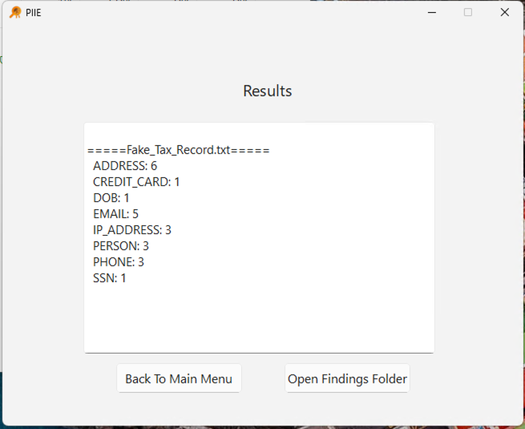
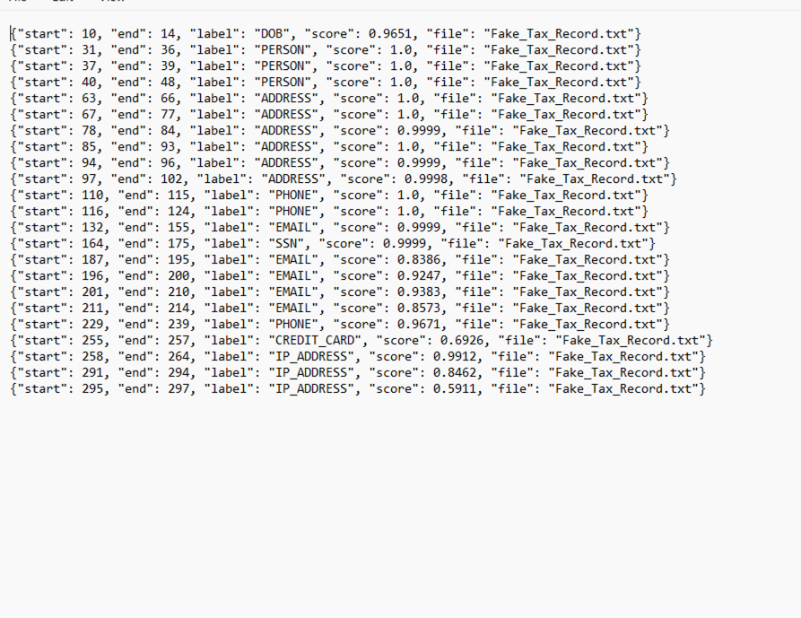

## Settings
* Thresholds- These affect the threshold of confidence for the AI. It is essentially a confidence score. Setting the SSN to .8 for example would ask the program to filter the document for SSN's if the confidence score given by the ai is above 80%.
* Output Location- This is where your output will be stored. Hit browse to go to the file location with browse you can set any folder as the output folder
* Logging Location- This is where logs saved in a txt format for ease of use.
* Batch size- Batch size controls how many token sequences (or chunks) the model processes at once during inference or training, affecting speed and memory usage.
* Merge Gap- Merge gap defines the maximum number of characters allowed between adjacent detected fragments for them to be combined into a single merged PII span.
## Results Screen

* This shows the amount of each PII record in the documents scanned.
## Findings Folder
* Opening this folder brings you to the file explorer containing the raw JSON collected by the AI

* Categories-
    1. Start/End - What character number the PII was found at
    2. Label -  What kind of PII was found
    3. Score - Ranged 0-1 decimal percentage, with 1 being the most confident and 0 having no confidence. You shouldn't have anything 0 unless it is set in the Settings before scanning
    4. File - What file the PII was found in - *only relevant when scanning multiple documents*
